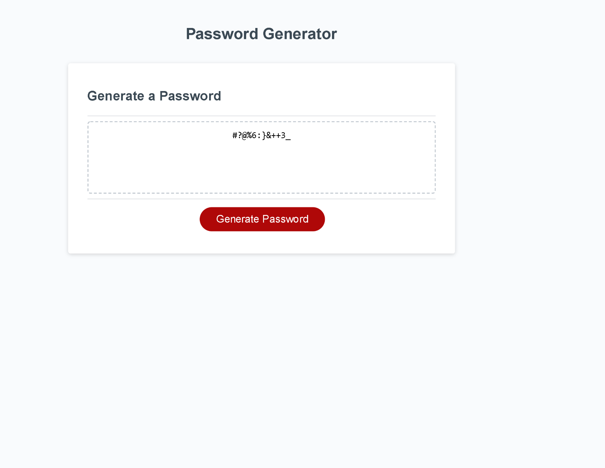

# Password Generator
## Contents
1. [About](#About)
2. [Description](#Description)
3. [Screenshot](#Screenshot)
3. [License](#License)
4. [Contact-Info](#Contact-Info)

## About
Generates a random password based on user input. User will define the length of the password along with what types of characters it will contain between uppercase and lowercase letters, numbers, and special characters. The resulting generated password will appear on the screen above the 'Generate Password' button.

## Description
[Deployed Application](https://amgaudet.github.io/password-generator/")
After clicking the generate password button, the user is prompted for their desired password length. If the user has an input outside the given parameters, the user will be reminded to enter a number between 8 and 128 to generate the password length. The user is then prompted to choose what different characters the password will contain. The script will then populate a string of characters the user selects and generate a password by randomly selecting a character to add to the password a number of times equal to the desired length.

## Screenshot

## Contact-Info

Alan Gaudet - <alanmgaudet@gmail.com>

Portfolio - <https://github.com/amgaudet>

## License
MIT License

Copyright (c) 2021 Alan Gaudet

Permission is hereby granted, free of charge, to any person obtaining a copy
of this software and associated documentation files (the "Software"), to deal
in the Software without restriction, including without limitation the rights
to use, copy, modify, merge, publish, distribute, sublicense, and/or sell
copies of the Software, and to permit persons to whom the Software is
furnished to do so, subject to the following conditions:

The above copyright notice and this permission notice shall be included in all
copies or substantial portions of the Software.

THE SOFTWARE IS PROVIDED "AS IS", WITHOUT WARRANTY OF ANY KIND, EXPRESS OR
IMPLIED, INCLUDING BUT NOT LIMITED TO THE WARRANTIES OF MERCHANTABILITY,
FITNESS FOR A PARTICULAR PURPOSE AND NONINFRINGEMENT. IN NO EVENT SHALL THE
AUTHORS OR COPYRIGHT HOLDERS BE LIABLE FOR ANY CLAIM, DAMAGES OR OTHER
LIABILITY, WHETHER IN AN ACTION OF CONTRACT, TORT OR OTHERWISE, ARISING FROM,
OUT OF OR IN CONNECTION WITH THE SOFTWARE OR THE USE OR OTHER DEALINGS IN THE
SOFTWARE.

